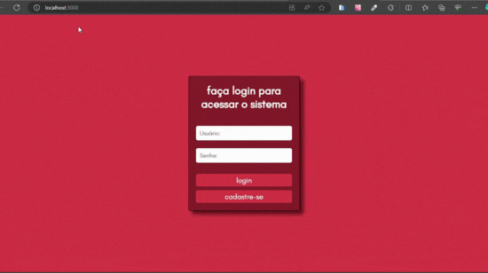
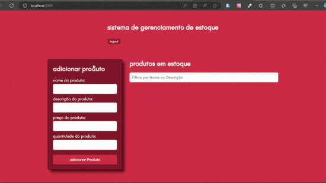
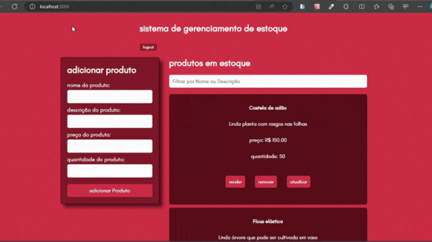

# Sistema de Gerenciamento de Estoque

Este é um sistema de gerenciamento de estoque desenvolvido em React. Ele permite adicionar novos produtos, visualizar produtos em estoque, remover produtos, realizar vendas e atualizar detalhes dos produtos.

  

  

## Funcionalidades Principais

### 1. Adicionar Produto

O formulário de adição de produto permite inserir informações sobre um novo produto, incluindo nome, descrição, preço e quantidade. Ao enviar o formulário, o produto é adicionado ao estoque.

  

### 2. Visualizar Produtos em Estoque

A lista de produtos em estoque é exibida, permitindo visualizar todos os produtos disponíveis. É possível filtrar os produtos por nome ou descrição para facilitar a busca.

### 3. Remover Produto

Cada produto na lista possui um botão para removê-lo do estoque. Ao clicar no botão "remover", é exibido um alerta de confirmação antes da remoção do produto.

  

### 4. Realizar Venda

É possível realizar vendas de produtos diretamente do estoque. Ao clicar no botão "vender" ao lado de um produto, o sistema solicita a quantidade desejada. Após inserir a quantidade, o estoque é atualizado.

  

### 5. Atualizar Detalhes do Produto

Os detalhes de um produto podem ser atualizados através do botão "atualizar". Ao clicar neste botão, o usuário pode inserir novos detalhes, como nome, descrição, preço e quantidade.

  

### 6. Autenticação de Usuário

O sistema possui autenticação de usuário. Para acessar o sistema, é necessário fazer login com um nome de usuário e senha. Se ainda não tiver uma conta, é possível se cadastrar.

  

## Estrutura do Código

O código é dividido em componentes React, cada um responsável por uma parte específica da aplicação:

- **ProdutoForm**: Responsável por adicionar novos produtos ao estoque.
- **EstoqueList**: Exibe a lista de produtos em estoque e permite operações como remover, vender e atualizar.
- **LoginForm**: Formulário de login para acessar o sistema.
- **RegistrationForm**: Formulário de registro de novo usuário.
- **App**: Componente principal que gerencia o estado de login, registro, produtos e usuários.

## Como Executar

Para executar o sistema, siga estas etapas:

1. Certifique-se de ter o Node.js instalado em sua máquina.
2. Clone este repositório.
3. Navegue até o diretório do projeto no terminal.
4. Instale as dependências usando o comando `npm install`.
5. Inicie o servidor de desenvolvimento com o comando `npm start`.
6. O sistema estará disponível em `http://localhost:3000` no seu navegador.

## Tecnologias Utilizadas

- **React**: Biblioteca JavaScript para construção de interfaces de usuário.
- **CSS**: Estilização dos componentes utilizando folhas de estilo CSS.
- **localStorage**: Armazenamento local para salvar os produtos em estoque.

## Autor

Desenvolvido por [Queriate Silva].

---

Este projeto é uma demonstração de um sistema de gerenciamento de estoque em React. Sinta-se à vontade para explorar, modificar e utilizar conforme necessário. Se tiver alguma dúvida ou sugestão, não hesite em entrar em contato.

E-MAIL: queriatejobs@gmail.com
